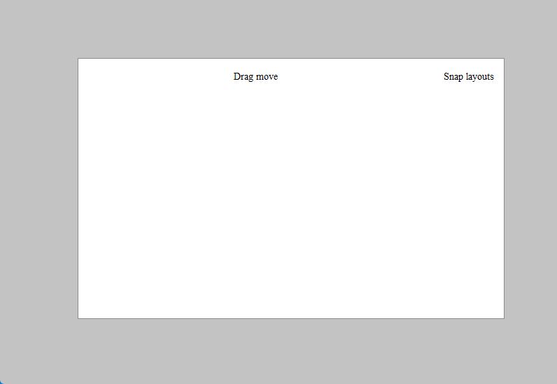

# ModernWindow

A Windows10/11 Modern Frameless Window DEMO.

It looks like Native window.

Features:

- Drag move

- Border resize

- Window shadow

- Snap windows

- Snap layouts

  

Run on Windows11:

Run on Windows10:

Comparison with other implementations:

Difference:

- Border highlight color (Settings enabled)
- Thick Frame (Outside window resize)

